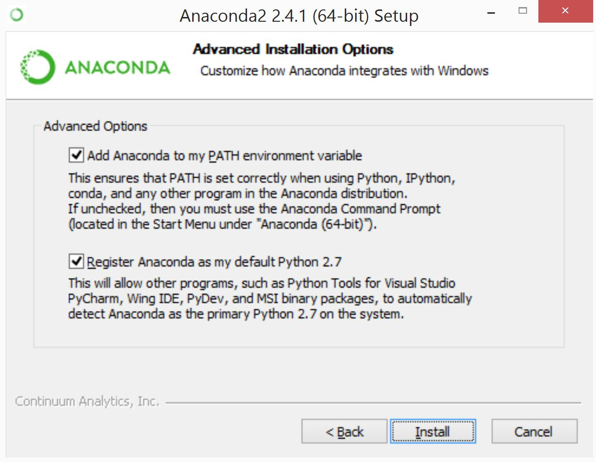

# Installing Anaconda

Follow along with the instructions below for your particular operating
system. If you're working off a unix distribution that is not Mac OS X,
you should be able to just work off the Mac OS X instructions, but change
which installation of Anaconda you're downloading (i.e. the Ubuntu install
if you're running Ubuntu, or the Linux install if you're running a different
installation of Linux).

## Mac OS X Users

1.) Open up your terminal application, and navigate to your home directory.
You can find the terminal application in `Finder`, and you can navigate to
your home directory by typing `cd` into the terminal and pressing enter.

2.) Enter the following command to download Anaconda:

```bash
curl https://repo.continuum.io/archive/Anaconda3-4.4.0-MacOSX-x86_64.sh -o ~/Downloads/Anaconda3-4.4.0-MacOSX-x86_64.sh
```

3.) Enter the following command to install Anaconda (make sure to say Yes when asked if you want to append `anaconda` to your path!):

```bash
bash ~/Downloads/Anaconda3-4.4.0-MacOSX-x86_64.sh
```

4.) Enter the following command to update all of the packages within Anaconda:

```bash
conda update --all
```

If you get the error `-bash: conda: command not found`, try running `source ~/.bash_profile` before running the command above.

If prompted, enter `yes` when prompted. If you aren't prompted, then
all your packages are up to date and you are good to go!


## Linux Users
1.) Navigate to the continuum.io downloads page.
[www.continuum.io/downloads](https://www.continuum.io/downloads#_unix)

2.) Click on the 32 bit or 64 bit **Python 3.6 version**, depending on
your system specification.

3.) The anaconda installer will be downloaded to your Downloads folder.
In terminal, navigate to your Downloads folder.

4.) In terminal in the Downloads folder type:
```bash
bash Anaconda3-4.4.0-Linux-x86_64.sh
```
(in this case the downloaded file was *Anaconda3-4.4.0-Linux-x86_64.sh*
but replace this with actual file downloaded, and **DO** type **bash**
in the terminal command above.)

In the ensuing installation menus, **make sure that you
have the `Add Anaconda to my PATH environment variable` checked**

## Windows Users

1.) Download [Anaconda][Anaconda], making sure to select the Windows
version, and the version using **Python 3.6**. **Make sure that you
have the `Add Anaconda to my PATH environment variable` checked when going
through installation...**



[Anaconda]:http://docs.continuum.io/anaconda/install#windows-install
